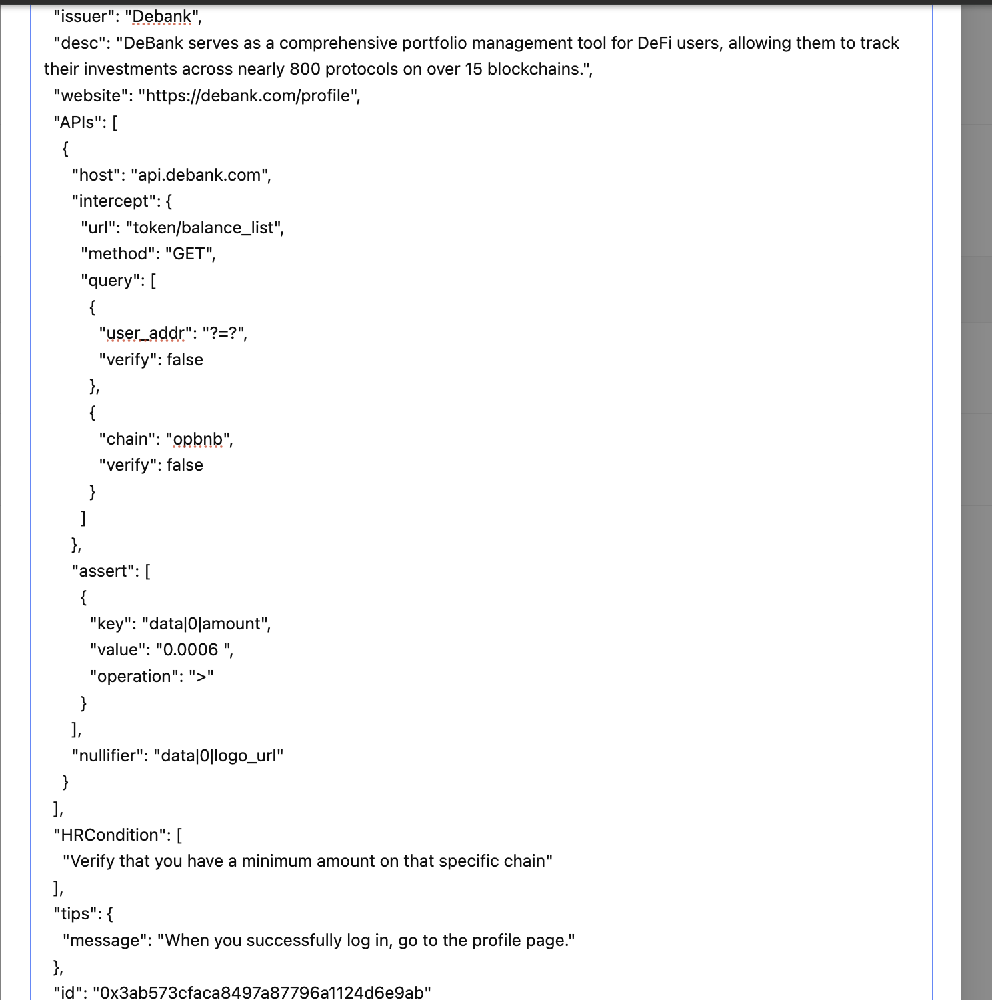

# Luma - Check onchain verified balance amount all major chains- Verification Schema

## Overview

DeBank serves as a comprehensive portfolio management tool for decentralized finance (DeFi) users, allowing them to track and analyze their investments across nearly 800 protocols on over 15 blockchains18. Its features include real-time data analytics, transaction history analysis, and multi-chain compatibility, making it an essential resource for managing DeFi portfolios effectively


## Issuer

- **Name:** Debank
- **Description:** DeBank is a comprehensive dashboard and portfolio tracker for decentralized finance (DeFi) that enables users to manage and analyze their assets across multiple protocols and blockchains.
- **Website:** [https://debank.com/](https://debank.com/)  


### User Profile Endpoint

```http
GET api.debank.com/token/balance_list

{
  "data": [
        {
            "amount": 0.006986879566036386,
            "balance": 6986879566036386,
            "chain": "opbnb",
            "credit_score": 100000000.0,
            "decimals": 18,
            "display_symbol": null,
            "id": "opbnb",
            "is_core": true,
            "is_custom": false,
            "is_scam": false,
            "is_suspicious": false,
            "is_verified": true,
            "is_wallet": true,
            "logo_url": "https://static.debank.com/image/coin/logo_url/bnb/9784283a36f23a58982fc964574ea530.png",
            "name": "BNB",
            "optimized_symbol": "BNB",
            "price": 719.0,
            "price_24h_change": 0.017844497946466538,
            "protocol_id": "",
            "symbol": "BNB",
            "time_at": null
        }
    ],
}


```
### Technical Breakdown
The schema is designed to verify balance of wallet on all major chains- Ethereum, Binance Smart Chain, Polygon, Solana, and others

Data Source: Verified from the token/balance_list GET request API.(query on all major chains)
Validation: The amount field is checked to ensure it is greater than 0.0006


## Schema Code

```json
{
  "issuer": "Debank",
  "desc": "DeBank serves as a comprehensive portfolio management tool for DeFi users, allowing them to track their investments across nearly 800 protocols on over 15 blockchains.",
  "website": "https://debank.com/profile",
  "APIs": [
    {
      "host": "api.debank.com",
      "intercept": {
        "url": "token/balance_list",
        "method": "GET",
        "query": [
          {
            "user_addr": "?=?",
            "verify": false
          },
          {
            "chain": "opbnb",
            "verify": false
          }
        ]
      },
      "assert": [
        {
          "key": "data|0|amount",
          "value": "0.0006",
          "operation": ">"
        }
      ],
      "nullifier": "data|0|logo_url"
    }
  ],
  "HRCondition": [
    "Verify that you have a minimum amount on that specific chain"
  ],
  "tips": {
    "message": "When you successfully log in, go to the profile page."
  },
  "id": "0x3ab573cfaca8497a87796a1124d6e9ab"
}

```


## Verification Process

1. **Login to Luma Portal**  
   Access your account by logging in to the Debank platform at [https://debank.com/](https://debank.com/).

2. **Go to Profile Page**  
   Navigate to your profile page after connecting & signing message with your wallet.

3. **Initiate Verification**  
   Click the "Start" button to trigger the amount verification process.

4. **Automatic Validation**  
   The system validates the `amount`  to ensure it is greater than 0.0006

## Tips for Users

- Ensure you are signed message with your wallet after connecting.
- Go to your profile page(click on profile page) to use your portfolio page information.  

## Category
- **onchain-Activity**


## Media 



