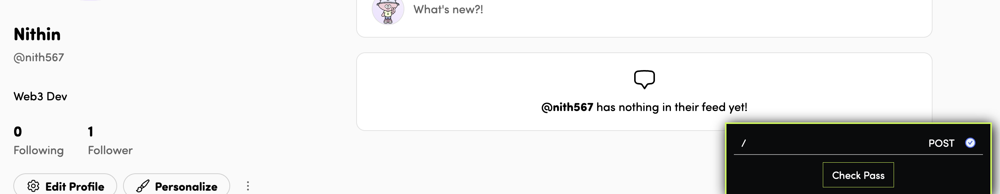
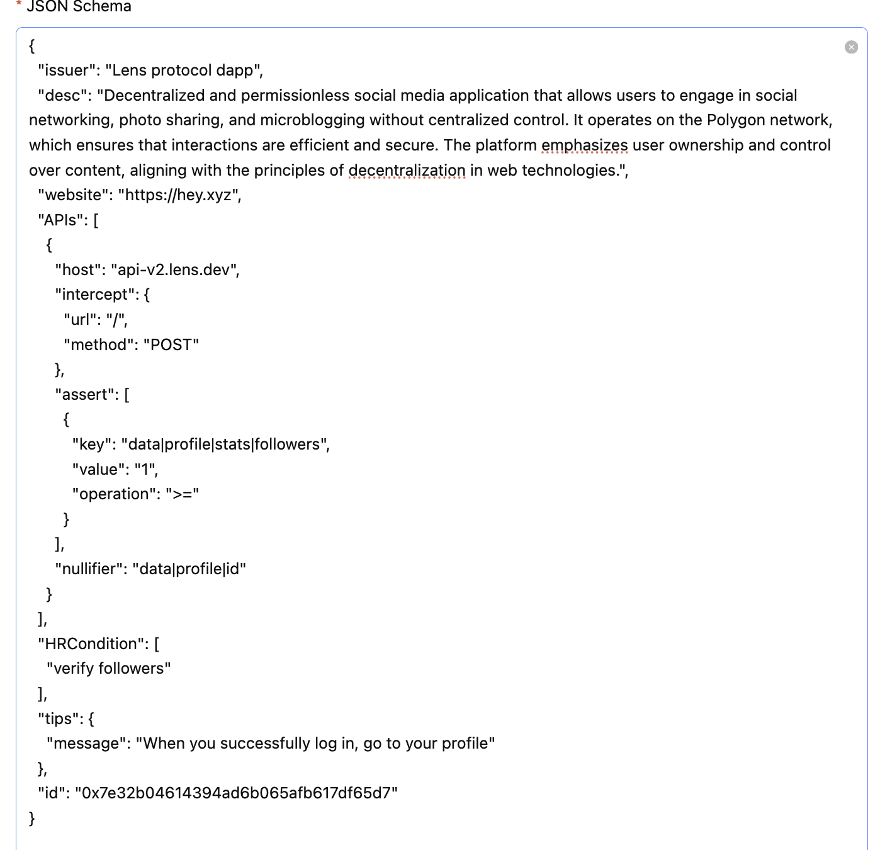

# Lens-protocol -decentralized and permissionless social media application - Followers Verification Schema

## Overview

Hey is a decentralized and permissionless social media application that allows users to engage in social networking, photo sharing, and microblogging without centralized control. It operates on the Polygon network, which ensures that interactions are efficient and secure. The platform emphasizes user ownership and control over content, aligning with the principles of decentralization in web technologies.

## Issuer

- **Name:** Lens(Hey-social media built on lens protocol)
- **Description:** Hey is a decentralized and permissionless social media application that allows users to engage in social networking, photo sharing, and microblogging without centralized control. This can verify followers of a user.
- **Website:** [https://hey.xyz/](https://hey.xyz/)  


### User Profile Endpoint

```http
GET api-v2.lens.dev


"data": 
        "profile": {
            "id": "0x06ccb2",
            "handle": {
                "fullHandle": "lens/nith567",
                "localName": "nith567",
                "linkedTo": {
                    "nftTokenId": "0x06ccb2",
                    "__typename": "HandleLinkedTo"
                },
                "__typename": "HandleInfo",
                "guardian": {
                    "cooldownEndsOn": null,
                    "protected": false,
                    "__typename": "HandleGuardianResult"
                }
            },
            "stats": {
                "id": "0x06ccb2",
                "followers": 1,
                "following": 0,
                "publications": 0,
                "comments": 0,
                "posts": 0,
                "mirrors": 0,
                "quotes": 0,
                "lensClassifierScore": 13,
                "__typename": "ProfileStats"
            },
     ....
}


```
### Technical Breakdown
The schema is designed to query the no.of followers.

Validation: The `followers` field is checked to ensure it is greater than or equal to 1 (in this example)


## Schema Code

```json
{
  "issuer": "Lens protocol dapp",
  "desc": "Decentralized and permissionless social media application that allows users to engage in social networking, photo sharing, and microblogging without centralized control. It operates on the Polygon network, which ensures that interactions are efficient and secure. The platform emphasizes user ownership and control over content, aligning with the principles of decentralization in web technologies.",
  "website": "https://hey.xyz",
  "APIs": [
    {
      "host": "api-v2.lens.dev",
      "intercept": {
        "url": "/",
        "method": "POST"
      },
      "assert": [
        {
          "key": "data|profile|stats|followers",
          "value": "1",
          "operation": ">="
        }
      ],
      "nullifier": "data|profile|id"
    }
  ],
  "HRCondition": [
    "verify followers"
  ],
  "tips": {
    "message": "When you successfully log in, go to your profile"
  },
  "id": "0xd17c774b5cbe4df9a2063f7392377ce5",
}
```


## Verification Process

1. **Login to Luma Portal**  
   Access your account by logging in to the talent-protocol platform at [https://hey.xyz/](https://hey.xyz/).

2. **Go to Profile Page**  
   Navigate to your profile page after wallet signin.

3. **Initiate Verification**  
   wait for 2-3 seconds then click the "check pass" button for score verification process.

4. **Automatic Validation**  
   The system validates the `followers`  to ensure it is greater than or equal to 1


## Category
- **Social**


## Media 



