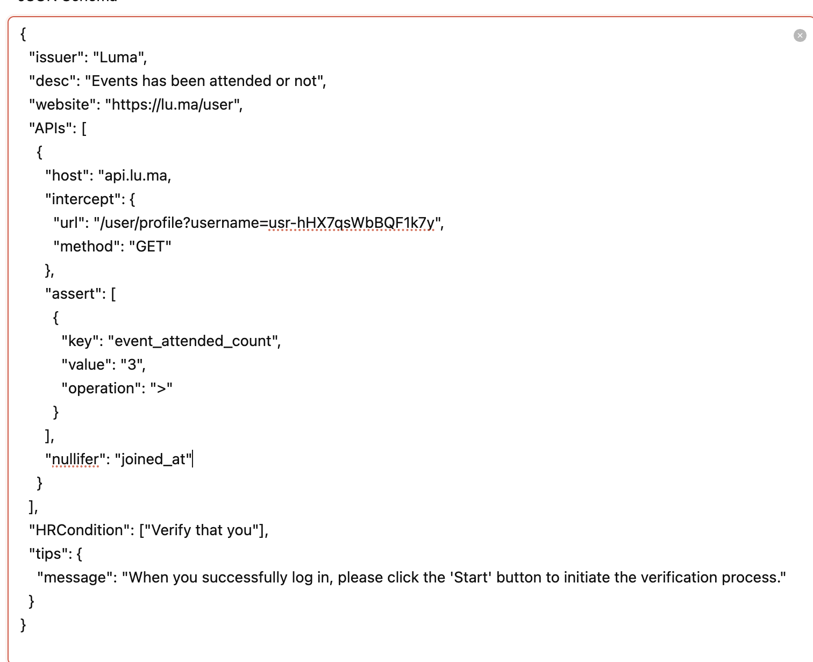
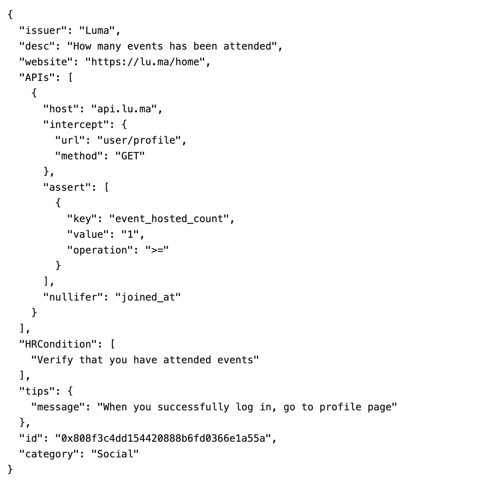

# Luma - Event Hosted Events and attendence Verification Schema

## Overview

Luma is a platform that helps users manage and attend events. This schema securely verifies a user's event attendance using the Luma API. The `event_attended_count` and `event_hosted_count` field is checked to confirm the user has attended more than three events and hosted more than one event respectively.

## Issuer

- **Name:** Luma  
- **Description:** A platform for managing and attending events.  
- **Website:** [https://lu.ma/home](https://lu.ma/home)  

## API Endpoints

### User Profile Endpoint

```http
GET https://api.lu.ma/user/profile

{
"event_attended_count": 23,
    "event_hosted_count": 1,
    "event_together_count": 0,
    "following": false,
    "joined_at": "2023-08-02T15:51:23.363Z",
    "user": {
        "api_id": "usr-hHX7qsWbBQF1k7y",
        "avatar_url": "https://cdn.lu.ma/avatars-default/avatar_0.png",
        "bio_short": null,
        "instagram_handle": null,
        "last_online_at": "2024-12-15T16:40:39.639Z",
        "linkedin_handle": null,
        "name": "Nithin",
        "tiktok_handle": null,
        "timezone": "Asia/Kolkata",
        "twitter_handle": null,
        "username": null,
        "website": null,
        "youtube_handle": null
    },
    "block_robots": false
}


```
### Technical Breakdown
The schema is designed to securely validate the number of events a user has attended:

Data Source: Verified from the user/profile GET request API.
Validation: The event_attended_count field is checked to ensure it is greater than 3.


## Schema Code

```json
{
  "issuer": "Luma",
  "desc": "How many events has been attended",
  "website": "https://lu.ma/home",
  "APIs": [
    {
      "host": "api.lu.ma",
      "intercept": {
        "url": "user/profile",
        "method": "GET"
      },
      "assert": [
        {
          "key": "event_attended_count",
          "value": "3",
          "operation": ">"
        }
      ],
      "nullifer": "joined_at"
    }
  ],
  "HRCondition": [
    "Verify that you have attended events"
  ],
  "tips": {
    "message": "When you successfully log in, go to profile page"
  },
  "category": "Social",
  "id": "0x205efa24da294938b74fda2477d0a942"
}
```

and For the second schema for hosting : 

``` json
{
  "issuer": "Luma",
  "desc": "How many events has been attended",
  "website": "https://lu.ma/home",
  "APIs": [
    {
      "host": "api.lu.ma",
      "intercept": {
        "url": "user/profile",
        "method": "GET"
      },
      "assert": [
        {
          "key": "event_hosted_count",
          "value": "1",
          "operation": ">="
        }
      ],
      "nullifer": "joined_at"
    }
  ],
  "HRCondition": [
    "Verify that you have attended events"
  ],
  "tips": {
    "message": "When you successfully log in, go to profile page"
  },
  "id": "0x808f3c4dd154420888b6fd0366e1a55a",
  "category": "Social"
}


```
## Verification Process

1. **Login to Luma Portal**  
   Access your account by logging in to the Luma platform at [https://lu.ma/home](https://lu.ma/home).

2. **Go to Profile Page**  
   Navigate to your profile page after logging in.

3. **Initiate Verification**  
   Click the "Start" button to trigger the verification process.

4. **Automatic Validation**  
   The system validates the `event_attended_count` and `event_hosted_count` to ensure it is greater than 3 and hosted greater than 1 

## Human-Readable Condition

- Verify that you have attended more than three events.

## Tips for Users

- Ensure you are logged in to your account on Luma.  
- Go to your profile page(click on profile page) to confirm your event attendance information.  
- If eligible, start the verification process to confirm your attendance count/hosted count.

## Category
- **Social**


## Media 





