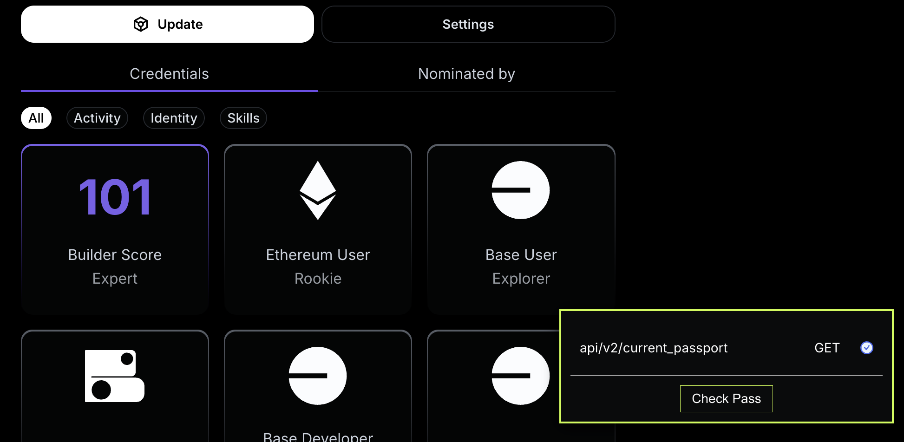
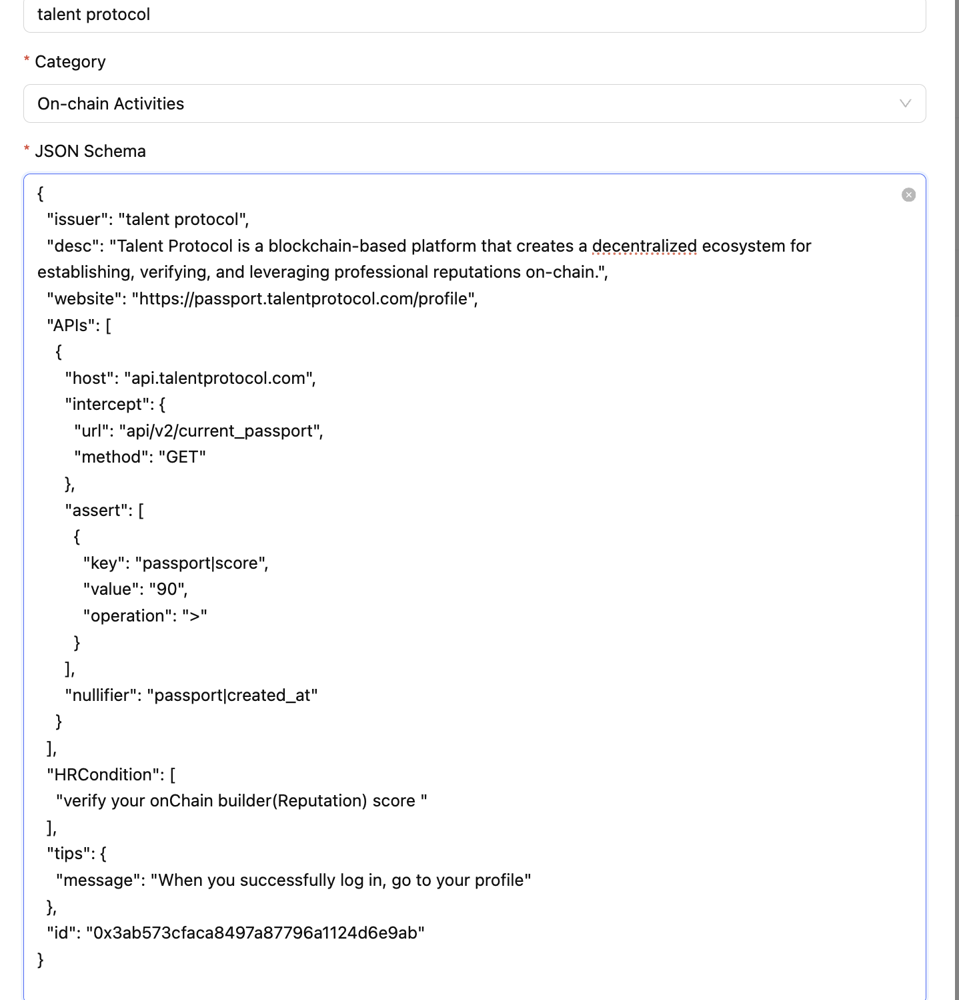

# Luma - Check onchain BuilderScore- Verification Schema

>Can also check other scores + credentials, even kyc from talent-protocol end (`pending_kyc` field)
## Overview

Talent Protocol is a blockchain-based platform that creates a decentralized ecosystem for establishing, verifying, and leveraging professional reputations on-chain. Its core features include the Talent Passport, an AI-powered profile that consolidates reputation data, and the $TALENT token, which incentivizes users to contribute verifiable information, enhancing transparency and accessibility in professional networking.


## Issuer

- **Name:** Talent-Protocol
- **Description:** Talent Protocol is a blockchain-based platform that creates a decentralized ecosystem for establishing, verifying, and leveraging professional reputations on-chain. Its core features include the Talent Passport, an AI-powered profile that consolidates reputation data, and the $TALENT token, which incentivizes users to contribute verifiable information, enhancing transparency and accessibility in professional networking.
- **Website:** [https://passport.talentprotocol.com/](https://passport.talentprotocol.com/)  


### User Profile Endpoint

```http
GET api/v2/current_passport

{
    passport:{
        ....
        ....
    ,    
    "pending_kyc": false,
        "score": 101,
        "skills_score": 56,
        "socials_calculated_at": "2024-12-15T22:09:04.103Z",
        "user": {
            "admin": false,
            "email": "nithinkatkam504106@gmail.com",
            "id": "8e003698-f19d-440c-8718-1654b244784a",
            "name": "nithinreddy",
            "profile_picture_url": "https://i.imgur.com/lXZh9fc.jpg"
        },
        "verified": true,
        ...
    }
}


```
### Technical Breakdown
The schema is designed to query the builder score, also used for others such as kyc verification via talent protocol(additional benifit),also can view their builder score,remaning onchain+offchain credentials

Data Source: Verified from the token/balance_list GET request API.(query on all major chains)
Validation: The score field is checked to ensure it is greater than 90


## Schema Code

```json
{
  "issuer": "talent protocol",
  "desc": "Talent Protocol is a blockchain-based platform that creates a decentralized ecosystem for establishing, verifying, and leveraging professional reputations on-chain.",
  "website": "https://passport.talentprotocol.com/profile",
  "APIs": [
    {
      "host": "api.talentprotocol.com",
      "intercept": {
        "url": "api/v2/current_passport",
        "method": "GET"
      },
      "assert": [
        {
          "key": "passport|score",
          "value": "90",
          "operation": ">"
        }
      ],
      "nullifier": "passport|created_at"
    }
  ],
  "HRCondition": [
    "verify your onChain builder(Reputation) score "
  ],
  "tips": {
    "message": "When you successfully log in, go to your profile"
  },
  "id": "0x7e32b04614394ad6b065afb617df65d7",
  "category": "On-chain Activities"
}

```


## Verification Process

1. **Login to Luma Portal**  
   Access your account by logging in to the talent-protocol platform at [https://passport.talentprotocol.com/](https://passport.talentprotocol.com/).

2. **Go to Profile Page**  
   Navigate to your profile page after sign through wallet or email login method

3. **Initiate Verification**  
   wait for 2-3 seconds then click the "check pass" button for score verification process.

4. **Automatic Validation**  
   The system validates the `score`  to ensure it is greater than 90


## Category
- **On-chain Activities**


## Media 



